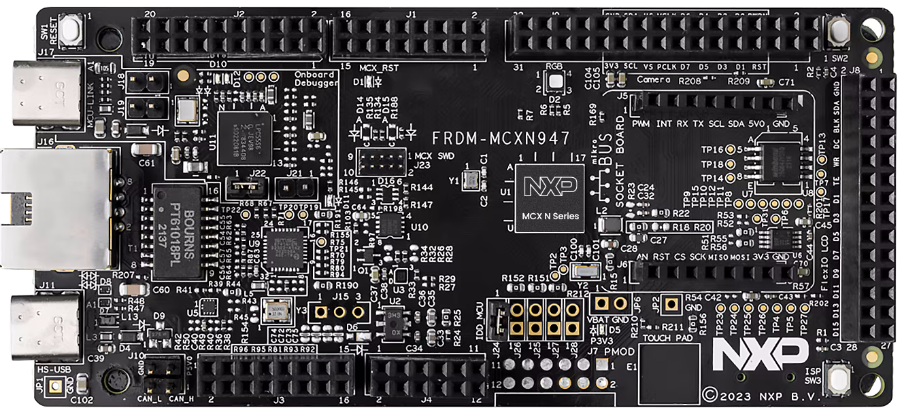
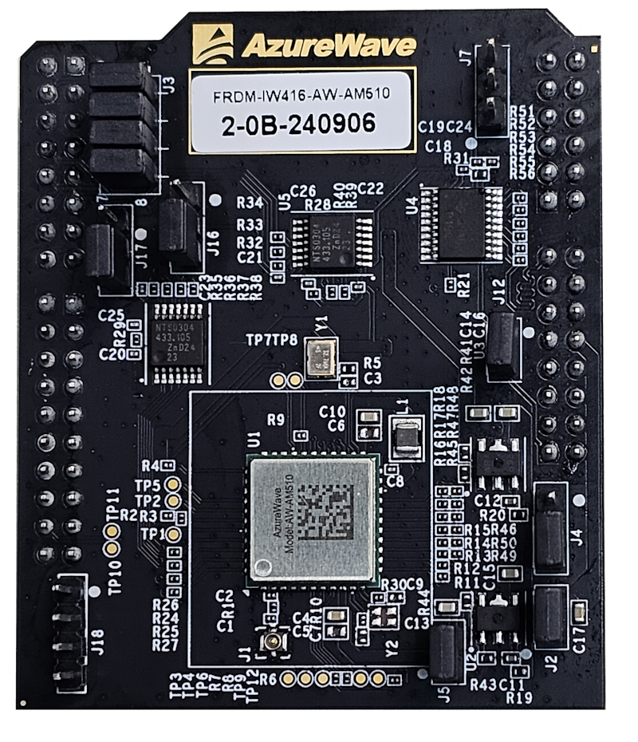
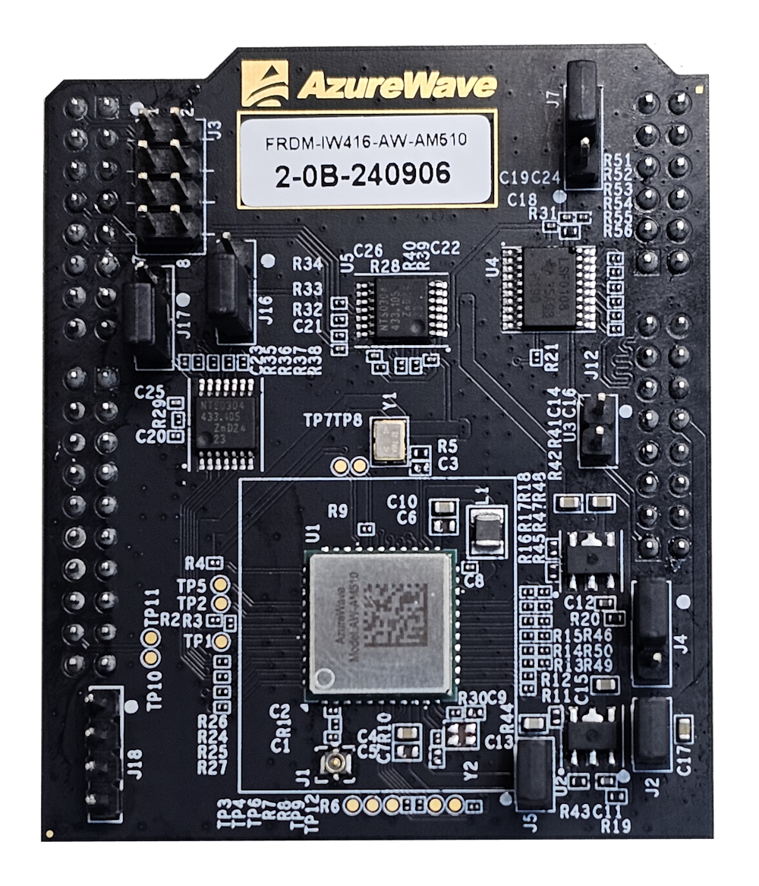
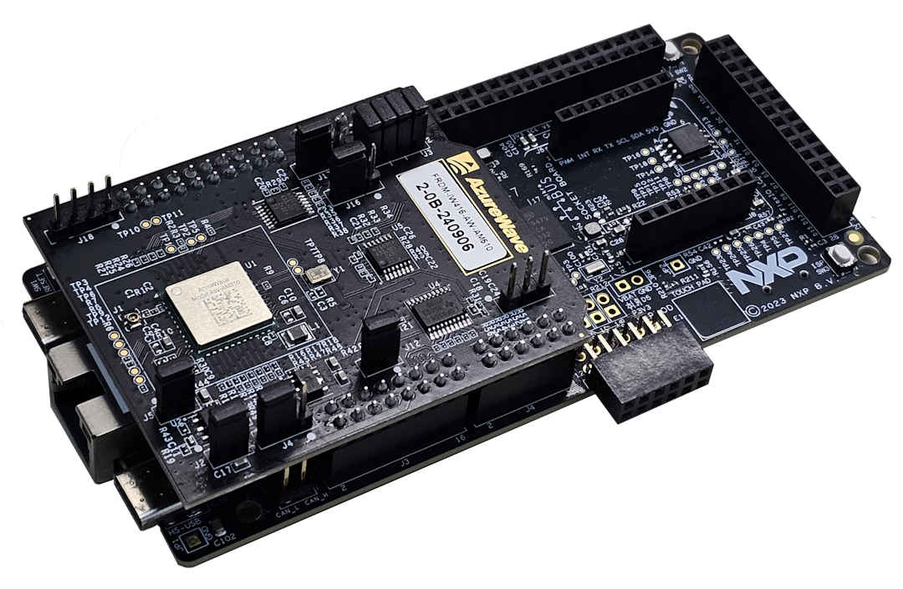

# NXP Application Code Hub

## WiFi CLI Azure Wave AW-AM510 FRDM MCXN947
This is an example of cli use with wifi running on serial terminal in frdm-mcxn947, this example has many test options for wifi.
There are the options: 
~~~
-help  
-wlan-version  
-wlan-mac  
-wlan-scan  
-wlan-scan-opt ssid <ssid> bssid ...  
-wlan-add <profile_name> ssid <ssid> bssid...  
-wlan-remove <profile_name>  
-wlan-list  
-wlan-connect <profile_name>  
-wlan-start-network <profile_name>  
-wlan-stop-network  
-wlan-disconnect  
-wlan-stat  
-wlan-info  
-wlan-address  
-wlan-get-uap-channel  
-wlan-get-uap-sta-list  
-ping [-s <packet_size>] [-c <packet_count>] [-W <timeout in sec>]<ip_address>  
-iperf [-s|-c <host>|-a|-h] [options]  
-dhcp-stat 
~~~

#### Boards: FRDM-MCXN947
#### Categories: Wireless Connectivity, RTOS
#### Peripherals: SDIO, UART
#### Toolchains: MCUXpresso IDE, VS Code

## Table of Contents
1. [Software](#step1)
2. [Hardware](#step2)
3. [Setup](#step3)
4. [Results](#step4)
5. [FAQs](#step5) 
6. [Support](#step6)
7. [Release Notes](#step7)

## 1. Software
- [MCUXpresso 11.9.0 or newer.](https://nxp.com/mcuxpresso)
- [MCUXpresso for VScode 1.5.61 or newer](https://www.nxp.com/products/processors-and-microcontrollers/arm-microcontrollers/general-purpose-mcus/lpc800-arm-cortex-m0-plus-/mcuxpresso-for-visual-studio-code:MCUXPRESSO-VSC?cid=wechat_iot_303216)
- [SDK for FRDM-MCXN947.](https://mcuxpresso.nxp.com/en/select)

## 2. Hardware
- [FRDM MCXN947](https://www.nxp.com/design/design-center/development-boards-and-designs/general-purpose-mcus/frdm-development-board-for-mcx-n94-n54-mcus:FRDM-MCXN947)   

- [FRDM-IW416-AW-AM510](https://www.azurewave.com/wireless-modules-nxp.html)   

## 3. Setup

### 3.1 Step 1
1. Open MCUXpresso IDE, in the Quick Start Panel, choose Import from Application Code Hub   

2. Enter the demo name in the search bar.    

3. Click Copy GitHub link, MCUXpresso IDE will automatically retrieve project attributes, then click Next>.    

4. Select main branch and then click Next>, Select the MCUXpresso project, click Finish button to complete import.    

### 3.2 Prepare demo
1.  Connect a USB type C cable between the PC host and the CMSIS DAP USB port on the board
2.  Open a serial terminal with the following settings:
    - 115200 baud rate
    - 8 data bits
    - No parity
    - One stop bit
    - No flow control
3.  Set jumpers of AW-AM510 module.   
  
4.  Connect the Wi-Fi module.   
  
5.  Download the program to the target board.
6.  Either press the reset button on your board or launch the debugger in your IDE to begin running the demo.

## 4. Results
1. Add CLI init API in applications main function.
2. Add WLAN CLI init API once WLAN Connection Manager gets initialized correctly.
3. When the demo starts, a welcome message would appear on the terminal, press enter for command prompt:
   Press tab or type help to list out all available CLI commands.

      wifi cli demo
    Initialize WLAN Driver
    MAC Address: C0:E4:34:5A:98:E9
    host init done
    [net] Initialized TCP/IP networking stack
    mass storage device attached:pid=0x5567vid=0x781 address=1
    app_cb: WLAN: received event 10
    app_cb: WLAN initialized
    WLAN CLIs are initialized
    CLIs Available:

    help
    wlan-version
    wlan-mac
    wlan-scan
    wlan-scan-opt ssid <ssid> bssid ...
    wlan-add <profile_name> ssid <ssid> bssid...
    wlan-remove <profile_name>
    wlan-list
    wlan-connect <profile_name>
    wlan-start-network <profile_name>
    wlan-stop-network
    wlan-disconnect
    wlan-stat
    wlan-info
    wlan-address
    wlan-get-uap-channel
    wlan-get-uap-sta-list
    ping [-s <packet_size>] [-c <packet_count>] [-W <timeout in sec>] <ip_address>
    iperf [-s|-c <host>|-a|-h] [options]
    dhcp-stat

    #help wlan-version wlan-mac wlan-scan wlan-scan-opt wlan-add wlan-remove wlan-list

    #help
    ~~~
    help
    wlan-version
    wlan-mac
    wlan-scan
    wlan-scan-opt ssid <ssid> bssid ...
    wlan-add <profile_name> ssid <ssid> bssid...
    wlan-remove <profile_name>
    wlan-list
    wlan-connect <profile_name>
    wlan-start-network <profile_name>
    wlan-stop-network
    wlan-disconnect
    wlan-stat
    wlan-info
    wlan-address
    wlan-get-uap-channel
    wlan-get-uap-sta-list
    ping [-s <packet_size>] [-c <packet_count>] [-W <timeout in sec>] <ip_address>
    iperf [-s|-c <host>|-a|-h] [options]
    dhcp-stat
    ~~~

    #wlan - version
      WLAN Driver Version   : v1.3.r21.p1
      WLAN Firmware Version : w8977o-V2, RF87XX, FP91, 16.91.10.p89, WPA2_CVE_FIX 1, PVE_FIX 1

    #wlan - mac
      MAC address
      C0:E4:34:5A:99:45

    #wlan - scan
      Scan scheduled...

    # 3 networks found:
     ~~~
      94:10:3E:02:60:F0  "nxp_mrvl" Infra
              channel: 1
              rssi: -25 dBm
              security: OPEN
              WMM: YES
      94:10:3E:02:60:F1  "nxp_mrvl_5ghz" Infra
              channel: 36
              rssi: -39 dBm
              security: OPEN
              WMM: YES
      90:72:40:21:B3:1A  "apple_g" Infra
              channel: 11
              rssi: -51 dBm
              security: WPA2
              WMM: YES
      ~~~~

    #wlan - scan - opt
      Usage:
          wlan-scan-opt ssid <ssid> bssid <bssid> channel <channel> probes <probes>
      Error: invalid number of arguments

    #wlan - scan - opt ssid apple_g
      Scan for ssid "apple_g" scheduled...

    # 2 networks found:
    ~~~~
      90:72:40:21:B3:1A  "apple_g" Infra
              channel: 11
              rssi: -52 dBm
              security: WPA2
              WMM: YES
      90:72:40:21:B3:1B  "apple_g" Infra
              channel: 149
              rssi: -60 dBm
              security: WPA2
              WMM: YES
    ~~~~

    #wlan - add
    ~~~~
      Usage:
      For Station interface
        For DHCP IP Address assignment:
          wlan-add <profile_name> ssid <ssid> [wpa2 <secret>]
          wlan-add <profile_name> ssid <ssid> [owe_only]
          wlan-add <profile_name> ssid <ssid> [wpa3 sae] <secret>
        For static IP address assignment:
          wlan-add <profile_name> ssid <ssid>
          ip:<ip_addr>,<gateway_ip>,<netmask>
          [bssid <bssid>] [channel <channel number>]
          [wpa2 <secret>]
      For Micro-AP interface
          wlan-add <profile_name> ssid <ssid>
          ip:<ip_addr>,<gateway_ip>,<netmask>
          role uap [bssid <bssid>]
          [channel <channelnumber>]
          [wpa2 <secret>]
      Error: invalid number of arguments
    ~~~~

    #wlan - add abc ssid nxp_mrvl
      Added "abc"

    #wlan - connect abc
      Connecting to network...
      Use 'wlan-stat' for current connection status.

    #Connected to following BSS : SSID = [nxp_mrvl], IP = [192.168.10.152]

    #wlan - stat
    ~~~
      Station connected (Active)
      uAP stopped
    ~~~

    #wlan - info
    ~~~
      Station connected to:
      "abc"
              SSID: nxp_mrvl
              BSSID: 94:10:3E:02:60:F0
              channel: 1
              role: Infra
              security: none

              IPv4 Address
              address: DHCP
                      IP:             192.168.10.152
                      gateway:        192.168.10.1
                      netmask:        255.255.255.0
                      dns1:           192.168.10.1
                      dns2:           0.0.0.0
      uAP not started
    ~~~
    #
    #wlan - add abd ssid NXP_Soft_AP ip : 192.168.10.1, 192.168.10.1, 255.255.255.0 role uap wpa2 12345678
      Added "abd"

    #wlan - start - network abd
    ~~~
      Soft AP "NXP_Soft_AP" Started successfully
      DHCP Server started successfully
    ~~~

    #wlan - info
    ~~~
      Station connected to:
      "abc"
              SSID: nxp_mrvl
              BSSID: 94:10:3E:02:60:F0
              channel: 1
              role: Infra
              security: none

              IPv4 Address
              address: DHCP
                      IP:             192.168.10.152
                      gateway:        192.168.10.1
                      netmask:        255.255.255.0
                      dns1:           192.168.10.1
                      dns2:           0.0.0.0
      uAP started as:
      "abd"
              SSID: NXP_Soft_AP
              BSSID: C0:E4:34:5A:99:45
              channel: 1
              role: uAP
              security: WPA2

              IPv4 Address
              address: STATIC
                      IP:             192.168.10.1
                      gateway:        192.168.10.1
                      netmask:        255.255.255.0
                      dns1:           192.168.10.1
                      dns2:           0.0.0.0
    ~~~
    #
    #wlan - disconnect

    #Dis - connected from : nxp_mrvl
    ~~~
      [wlcm] Warn: got event: deauthentication
    ~~~

    #wlan - info
    ~~~
      Station not connected
      uAP started as:
      "abd"
              SSID: NXP_Soft_AP
              BSSID: C0:E4:34:5A:99:45
              channel: (Auto)
              role: uAP
              security: WPA2

              IPv4 Address
              address: STATIC
                      IP:             192.168.10.1
                      gateway:        192.168.10.1
                      netmask:        255.255.255.0
                      dns1:           192.168.10.1
                      dns2:           0.0.0.0
     ~~~
    #

    #wlan - list
    ~~~
      2 networks:
      "abc"
              SSID: nxp_mrvl
              BSSID: 00:00:00:00:00:00
              channel: (Auto)
              role: Infra
              security: none
      "abd"
              SSID: NXP_Soft_AP
              BSSID: 00:00:00:00:00:00
              channel: (Auto)
              role: uAP
              security: WPA2

              IPv4 Address
              address: STATIC
                      IP:             192.168.10.1
                      gateway:        192.168.10.1
                      netmask:        255.255.255.0
                      dns1:           192.168.10.1
                      dns2:           0.0.0.0
    ~~~
    #

    #wlan - remove abc
    ~~~
      Removed "abc"
    ~~~

    #wlan - list
    ~~~
      1 network:
      "abd"
              SSID: NXP_Soft_AP
              BSSID: 00:00:00:00:00:00
              channel: (Auto)
              role: uAP
              security: WPA2

              IPv4 Address
              address: STATIC
                      IP:             192.168.10.1
                      gateway:        192.168.10.1
                      netmask:        255.255.255.0
                      dns1:           192.168.10.1
                      dns2:           0.0.0.0
    ~~~
    #
    #

    #wlan - address
    ~~~
      not connected
    ~~~

    #wlan - get

    #wlan - get - uap - channel
    ~~~
      uAP channel: 0
    ~~~

    #

    #dhcp - stat
    DHCP Server Lease Duration : 86400 seconds
    No IP-MAC mapping stored

## 5. FAQs
No FAQs have been identified for this project.

## 6. Support
No URL

#### Project Metadata
<!----- Boards ----->

<!----- Categories ----->
 

<!----- Peripherals ----->
 

<!----- Toolchains ----->
 

Questions regarding the content/correctness of this example can be entered as Issues within this GitHub repository.

>**Warning**: For more general technical questions regarding NXP Microcontrollers and the difference in expected funcionality, enter your questions on the [NXP Community Forum](https://community.nxp.com/)

## 7. Release Notes
| Version | Description / Update                           | Date                        |
|:-------:|------------------------------------------------|----------------------------:|
| 1.0     | Initial release on Application Code Hub        | March 26th 2024 |

